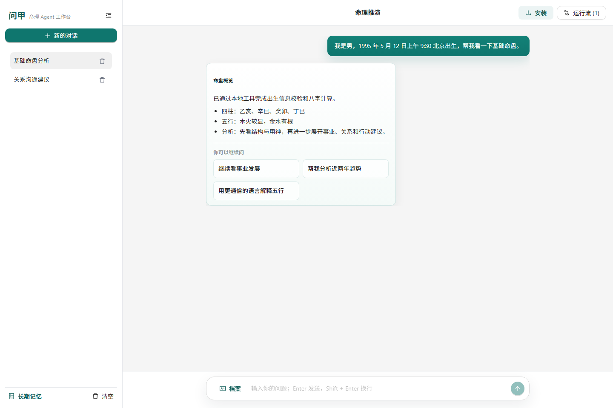

<div align="center">


# wenjia-agent

基于 OpenAI Agents SDK 的开源中文命理 Agent 项目。

[](LICENSE)
[](https://github.com/Hjiassen/wenjia-agent/actions/workflows/ci.yml)
[](https://github.com/Hjiassen/wenjia-agent/releases)
[](pyproject.toml)
[](https://github.com/openai/openai-agents-python)
[](https://www.jiajiahome.top/)
[](compose.yaml)
[](apps/web/backend)
[](apps/web/frontend)
[](apps/web/frontend/package.json)
[](apps/web/frontend/public/manifest.webmanifest)
[](pyproject.toml)
[](tests)

[简体中文](README.md) | [English](README.en.md)

[在线 Demo](https://www.jiajiahome.top/) | [部署指南](docs/DEPLOYMENT.md) | [Web App](apps/web/README.md)

</div>

## 项目简介

`wenjia` 取“问甲”之意。`wenjia-agent` 面向中文命理场景，将确定性八字计算、OpenAI Agents SDK
编排、function tools、会话记忆、结构化报告和 Prompt 模板组织成一个轻量、
可扩展的 Python 工程。

核心思路很简单：命盘基础数据由本地工具确定性计算，Agent 负责追问、路由、
解释和结构化报告生成。

## 目录

- [在线 Demo](#在线-demo)
- [适合场景](#适合场景)
- [Web App 预览](#web-app-预览)
- [特性](#特性)
- [Agent 拓扑](#agent-拓扑)
- [快速开始](#快速开始)
- [配置](#配置)
- [Python 用法](#python-用法)
- [项目结构](#项目结构)
- [开发](#开发)
- [部署](#部署)
- [文档](#文档)
- [负责任使用](#负责任使用)

## 在线 Demo

在线体验：https://www.jiajiahome.top/

Demo 用于展示浏览器聊天、资料面板、长期记忆和 Agent 流程可视化。公开部署时请自行配置
鉴权、限流、日志留存和成本保护。

## 适合场景

- 想学习 OpenAI Agents SDK 多 Agent 编排、handoff、function tools 和结构化输出的开发者。
- 想把确定性业务逻辑和 LLM 对话解释层拆开的 Agent 应用开发者。
- 想参考 FastAPI + React + SSE 流式聊天、流程可视化、PWA 和部署脚本的工程实现者。
- 想围绕中文命理文化做开源 Prompt、工具和产品原型的人。

## Web App 预览



## 特性

| 特性 | 说明 |
| --- | --- |
| 多 Agent 工作流 | 主控 Agent 负责路由，专门 Agent 负责具体任务。 |
| 出生信息门禁 | 个性化命理问题必须先提供完整出生信息，才能继续排盘或分析。 |
| 确定性八字核心 | 八字、真太阳时、五行、十神、纳音、神煞、空亡、命宫等结果由本地逻辑计算。 |
| 工具优先推理 | Agent 通过 function tools 获取命盘数据，避免由模型自行推算关键命理字段。 |
| 结构化输出 | 命格、关系、起名报告使用 Pydantic schema 约束，方便上层应用集成。 |
| Prompt-as-code | 长提示词位于 `wenjia_agent/prompts`，支持版本化维护和社区协作。 |
| 会话记忆 | 基于 `SQLAlchemySession` 提供 Agent 会话记忆。 |
| Poetry 工作流 | 内置 CLI 示例、测试、lint 和开发文档。 |

## Agent 拓扑

| Agent | 职责 |
| --- | --- |
| `WenjiaMainAgent` | 识别用户意图，并将任务移交给专门 Agent。 |
| `ProfileAgent` | 收集出生资料、查询城市、生成基础八字命盘。 |
| `FortuneAgent` | 生成命格、事业、财富、关系和行动建议分析。 |
| `RelationshipAgent` | 分析合盘、关系模式和沟通建议。 |
| `NamingAgent` | 生成中文起名策略和名字建议。 |
| `MysticToolsAgent` | 解释工具字段、查询支持地区、排查参数问题。 |

```text
WenjiaMainAgent
  ├─ ProfileAgent
  ├─ FortuneAgent
  ├─ RelationshipAgent
  ├─ NamingAgent
  └─ MysticToolsAgent
```

## 快速开始

### 环境要求

- Python 3.11+
- Poetry 1.8+
- Node.js 20+（运行 Web App 前端时需要）
- Docker / Docker Compose（可选，用于容器化运行）

### 安装

Windows PowerShell:

```powershell
git clone https://github.com/Hjiassen/wenjia-agent.git
cd wenjia-agent
poetry install --with dev
Copy-Item .env.example .env
```

Linux:

```bash
git clone https://github.com/Hjiassen/wenjia-agent.git
cd wenjia-agent
poetry install --with dev
cp .env.example .env
```

### 运行确定性八字 Demo

该 Demo 调用本地八字核心，不需要 API key。

Windows PowerShell:

```powershell
poetry run python examples\cli_bazi.py
```

Linux:

```bash
poetry run python examples/cli_bazi.py
```

示例输出：

```text
四柱八字：
乙亥 辛巳 癸卯 丁巳
五行分布： {'木': 3, '火': 6, '土': 1, '金': 3, '水': 3}
```

### 运行 Agent CLI

先在 `.env` 中填写 `OPENAI_API_KEY`。

Windows PowerShell:

```powershell
poetry run python examples\cli_agent.py
```

Linux:

```bash
poetry run python examples/cli_agent.py
```

### 运行 Web App

Web App 采用彻底的前后端分离：一个**只提供 API 的 FastAPI 后端**（JSON + SSE），加一个用 [Ant Design X](https://x.ant.design/)（Bubble / Sender / Conversations / ThoughtChain）构建的独立 **React + TypeScript（Vite）SPA**。两个进程分别启动。

后端（先在 `.env` 填好 `OPENAI_API_KEY`）：

```bash
poetry run uvicorn apps.web.backend.main:app --reload --host 127.0.0.1 --port 8000
```

前端（开发服务器 5173 端口，自动把 `/api`、`/health` 代理到后端）：

```bash
cd apps/web/frontend
npm install
npm run dev
```

打开 http://localhost:5173。生产环境执行 `npm run build`，产物在 `apps/web/frontend/dist/`，可托管到任意静态服务；跨域时用 `WENJIA_CORS_ORIGINS` 放行前端来源。详见 [apps/web/README.md](apps/web/README.md)。

在线 Demo：https://www.jiajiahome.top/

## 配置

从 `.env.example` 创建 `.env`，并配置运行时参数：

```env
OPENAI_API_KEY=
OPENAI_BASE_URL=https://api.openai.com/v1
OPENAI_AGENT_MODEL=gpt-4.1-mini
OPENAI_ANALYSIS_MODEL=gpt-4.1-mini
OPENAI_FALLBACK_MODEL=
WENJIA_CORS_ORIGINS=http://localhost:5173,http://127.0.0.1:5173,https://www.jiajiahome.top
WENJIA_SESSION_DB_URL=sqlite+aiosqlite:///./wenjia_agent_sessions.db
WENJIA_SESSION_HISTORY_LIMIT=40
WENJIA_HARNESS_MAX_TURNS=16
WENJIA_HARNESS_MAX_REVISIONS=1
WENJIA_HARNESS_REVISE=true
WENJIA_INPUT_GUARDRAILS_ENABLED=true
WENJIA_INPUT_MAX_CHARS=8000
WENJIA_LONG_TERM_MEMORY_ENABLED=true
WENJIA_LONG_TERM_MEMORY_MAX_ITEMS=8
WENJIA_MODEL_TIMEOUT_SECONDS=90
WENJIA_TRACE_ENABLED=true
WENJIA_TRACE_DIR=logs/traces
WENJIA_OPENAI_SDK_TRACING=false
```

- `OPENAI_AGENT_MODEL`：主控路由、资料收集、工具查询等轻量 Agent。
- `OPENAI_ANALYSIS_MODEL`：命格、合盘、起名、推荐问题等正式分析。
- `OPENAI_FALLBACK_MODEL`：主模型超时或异常时的备用模型；留空则不 fallback。
- `WENJIA_CORS_ORIGINS`：允许访问后端的浏览器来源，公开部署时应收紧到实际域名。
- `WENJIA_SESSION_HISTORY_LIMIT`：每轮从同一会话取回的最近历史条数。
- `WENJIA_HARNESS_*`：控制多轮 harness 的最大轮次、修订次数和是否启用修订。
- `WENJIA_INPUT_GUARDRAILS_ENABLED`：启用确定性输入护栏，拦截越狱、高风险决策和违法伤害类请求。
- `WENJIA_LONG_TERM_MEMORY_ENABLED`：启用基于调用方 `client_id` 的跨会话长期记忆。
- `WENJIA_TRACE_DIR`：本地 JSONL 运行追踪目录，用于查看路由、工具、耗时、usage 和 fallback。
- `WENJIA_OPENAI_SDK_TRACING`：是否开启 OpenAI Agents SDK tracing；本地 JSONL trace 默认独立可用。

## Python 用法

### 确定性排盘

```python
from wenjia_agent.domain.bazi_adapter import BaziAdapter
from wenjia_agent.domain.schemas import BirthInfo

adapter = BaziAdapter()
result = adapter.calculate(
    BirthInfo(
        name="示例",
        gender="未知",
        birth_year=1995,
        birth_month=5,
        birth_day=12,
        birth_hour=9,
        birth_minute=30,
        calendar_type="solar",
        province="北京市",
        city="北京市",
    )
)

print(result.year_pillar, result.month_pillar, result.day_pillar, result.hour_pillar)
print(result.five_elements)
```

### Agent Runner

```python
import asyncio

from wenjia_agent.runtime.runner import run_agent


async def main() -> None:
    response = await run_agent(
        session_id="demo-session",
        message="帮我看一下 1995 年 5 月 12 日上午 9:30 北京出生的基础命盘。",
    )
    print(response)


asyncio.run(main())
```

## 项目结构

```text
wenjia_agent/        # 可复用的 Agent 内核（可被 import 的包）
  agents/            # OpenAI Agents SDK Agent 定义
  core/              # 确定性命理逻辑
  domain/            # Pydantic schemas、adapters、context builders
  prompts/           # 版本化提示词模板
  runtime/           # 配置、runner、会话辅助
  tools/             # OpenAI Agents SDK function tools
apps/                # 一等入口（内核之上的适配器）
  web/
    backend/         # 只提供 API 的 FastAPI 服务（JSON + SSE）
    frontend/        # React + Ant Design X SPA
docs/                # 需求、架构、设计、贡献文档
examples/            # CLI 示例
tests/               # 单元测试
```

## 核心设计

`wenjia-agent` 将确定性命理计算和语言生成分离：

1. `wenjia_agent/core` 与 `wenjia_agent/domain` 提供可测试、可复现的计算逻辑。
2. `wenjia_agent/agents` 与 `wenjia_agent/prompts` 负责对话、追问、解释和结构化报告。

关键命理字段必须通过工具获得。Agent 可以解释工具结果、整理报告、补充语境
和建议，但不直接编造四柱、五行、十神、神煞等基础数据。

排盘、命格分析、合盘、起名和个性化建议都需要先经过完整出生信息门禁。
如果缺少必要字段，Agent 会持续追问缺失信息，再继续处理请求。

## 开发

Windows PowerShell:

```powershell
poetry check
poetry run ruff check . --no-cache
poetry run pytest
poetry run python scripts/run_evals.py
poetry run python -m compileall wenjia_agent examples tests
cd apps/web/frontend
npm run build
```

Linux:

```bash
poetry check
poetry run ruff check . --no-cache
poetry run pytest
poetry run python scripts/run_evals.py
poetry run python -m compileall wenjia_agent examples tests
cd apps/web/frontend
npm run build
```

## 部署

完整部署说明见 [部署指南](docs/DEPLOYMENT.md)。仓库内置三种公开运行路径：

- `scripts/deploy_ubuntu.sh`：已有 Python / Poetry / Node 环境的轻量预览服务器。
- `scripts/deploy_static_nginx.sh` + [nginx.example.conf](docs/deploy/nginx.example.conf)：Nginx 托管静态前端并反代 FastAPI。
- [compose.yaml](compose.yaml)：一条命令启动后端容器和前端 Nginx 容器。

Docker Compose:

```bash
cp .env.example .env
docker compose up --build
```

打开 http://localhost:8080。

## 文档

| 文档 | 说明 |
| --- | --- |
| [需求报告](docs/REQUIREMENTS.md) | 产品范围和验收标准。 |
| [Agent 策划书](docs/AGENT_PROPOSAL.md) | Agent 项目定位和路线图。 |
| [软件设计文档](docs/SOFTWARE_DESIGN.md) | 技术设计和实现边界。 |
| [架构说明](docs/ARCHITECTURE.md) | 模块布局和运行时架构。 |
| [研发流程](docs/RD_PROCESS.md) | 开发工作流和发布流程。 |
| [Agent 流程可视化](docs/AGENT_FLOW_VISUALIZATION.md) | SSE 事件协议和 Web Demo 可视化设计。 |
| [开发指南](docs/DEVELOPMENT.md) | 本地环境和日常命令。 |
| [部署指南](docs/DEPLOYMENT.md) | 本地、Ubuntu、Nginx 和 Docker Compose 部署方式。 |
| [贡献指南](docs/CONTRIBUTING.md) | 贡献规则和检查清单。 |
| [工具插件指南](docs/TOOL_PLUGIN_GUIDE.md) | 工具设计和扩展指南。 |
| [Web App](apps/web/README.md) | 前后端分离的 Web 应用用法和接口说明。 |
| [安全政策](SECURITY.md) | 漏洞报告、敏感数据和部署安全说明。 |
| [行为准则](CODE_OF_CONDUCT.md) | 社区协作规则。 |
| [变更日志](CHANGELOG.md) | 版本变更记录。 |

## 贡献

欢迎提交 issue、Prompt 改进、工具扩展、测试用例和文档更新。建议先阅读
[贡献指南](docs/CONTRIBUTING.md)、[工具插件指南](docs/TOOL_PLUGIN_GUIDE.md)
和 [行为准则](CODE_OF_CONDUCT.md)。安全问题请按 [安全政策](SECURITY.md) 私下报告。

## 负责任使用

命理内容仅作文化娱乐与个人参考。涉及医疗、法律、投资、心理危机等高风险
问题时，应结合现实情况并寻求专业帮助。公开部署者还需要自行承担鉴权、限流、
滥用监控、成本控制、数据留存和合规义务。

## License

Apache-2.0
